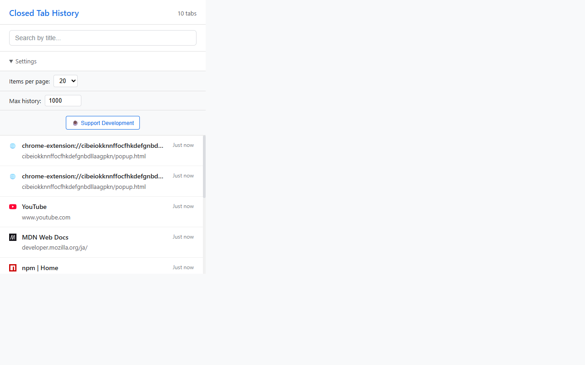

# Closed Tab History

> Track and restore closed browser tabs with search, pagination, and history management

[](https://chrome.google.com/webstore)
[](https://github.com/yourusername/chrome-closed-tab-history)
[](LICENSE)

[English](#english) | [日本語](#japanese)

---

<a name="english"></a>
## 🌟 Features

- **📝 Track Closed Tabs**: Automatically saves up to 1,000 recently closed tabs
- **🔍 Search Functionality**: Quickly find tabs by title with real-time filtering
- **📄 Pagination**: Browse history with customizable items per page (10/20/30)
- **⚙️ Customizable Settings**: Configure max history limit and display preferences
- **🚀 One-Click Restore**: Reopen closed tabs instantly with a single click
- **💾 Persistent Storage**: History saved locally, survives browser restarts
- **🎨 Clean UI**: Simple, intuitive interface with favicon display

## 📸 Screenshots

<table>
  <tr>
    <td></td>
    <td></td>
  </tr>
  <tr>
    <td align="center">Main View</td>
    <td align="center">Search Functionality</td>
  </tr>
  <tr>
    <td></td>
    <td></td>
  </tr>
  <tr>
    <td align="center">Settings Panel</td>
    <td></td>
  </tr>
</table>

## 🚀 Installation

### From Chrome Web Store (Recommended)
1. Visit the [Chrome Web Store page](#) (link coming soon)
2. Click "Add to Chrome"
3. Confirm the installation

### Manual Installation (Developer Mode)
1. Download or clone this repository
2. Open Chrome and navigate to `chrome://extensions/`
3. Enable "Developer mode" (toggle in top right)
4. Click "Load unpacked"
5. Select the extension directory

## 💻 Usage

1. **Open the Extension**: Click the extension icon in your Chrome toolbar
2. **View History**: See all recently closed tabs with timestamps
3. **Search**: Type in the search box to filter tabs by title
4. **Restore Tab**: Click any tab entry to reopen it
5. **Settings**: Adjust display count and max history limit

## 🛠️ Technical Details

### Architecture
- **Manifest Version**: 3 (latest Chrome extension standard)
- **Service Worker**: Background script for tab lifecycle tracking
- **Storage**: Chrome's local storage API
- **Memory Cache**: Efficient Map-based tracking (4,000+ tabs)

### Key Features Implementation
- **Race Condition Protection**: Promise queue for concurrent tab closures
- **Startup Tab Loading**: Captures all open tabs on browser restart
- **Filtered URLs**: Excludes chrome://, about:blank, and empty URLs
- **Memory Efficient**: Automatic cleanup of old entries

### File Structure
```
chrome-closed-tab-history/
├── manifest.json          # Extension manifest (MV3)
├── background.js          # Service worker (tab tracking)
├── popup.html            # Extension popup UI
├── popup.js              # Popup logic
├── popup.css             # Popup styles
├── icons/                # Extension icons
│   ├── icon16.png
│   ├── icon32.png
│   ├── icon48.png
│   ├── icon128.png
│   └── source-icon.svg
└── screenshots/          # Promotional images
```

## ⚙️ Configuration

### Default Settings
- **Max History**: 1,000 tabs
- **Items per Page**: 20 tabs
- **Memory Cache**: 4,000 tabs

### Customizable Options
- Max history limit: 10-1,000 tabs
- Display count: 10/20/30 per page

## 🔒 Privacy

- **100% Local**: All data stored locally on your device
- **No Tracking**: No analytics or user tracking
- **No Remote Code**: All code bundled in extension
- **Minimal Permissions**: Only requires `tabs` and `storage`

## 🤝 Contributing

Contributions are welcome! Please feel free to submit a Pull Request.

1. Fork the repository
2. Create your feature branch (`git checkout -b feature/AmazingFeature`)
3. Commit your changes (`git commit -m 'Add some AmazingFeature'`)
4. Push to the branch (`git push origin feature/AmazingFeature`)
5. Open a Pull Request

## 📝 License

This project is licensed under the MIT License - see the [LICENSE](LICENSE) file for details.

## ☕ Support

If you find this extension useful, consider supporting the development:

[](https://ko-fi.com/tonbo3751)

## 📊 Changelog

### Version 1.0.2 (Current)
- Increased default max history to 1,000 tabs
- Fixed critical bug: Load existing tabs on startup
- Increased memory cache to 4,000 tabs
- Added Ko-fi donation button

### Version 1.0.1
- Initial public release
- Basic tab tracking and restoration
- Search and pagination features

---

<a name="japanese"></a>
## 🌟 機能

- **📝 閉じたタブを追跡**: 最大1,000件の閉じたタブを自動保存
- **🔍 検索機能**: タイトルでタブを素早く検索、リアルタイムフィルタリング
- **📄 ページネーション**: 表示件数をカスタマイズ（10/20/30件）
- **⚙️ カスタマイズ可能な設定**: 最大履歴数と表示設定を調整
- **🚀 ワンクリック復元**: 閉じたタブを即座に再オープン
- **💾 永続ストレージ**: ブラウザ再起動後も履歴を保持
- **🎨 クリーンなUI**: シンプルで直感的なインターフェース、favicon表示

## 📸 スクリーンショット

<table>
  <tr>
    <td></td>
    <td></td>
  </tr>
  <tr>
    <td align="center">メインビュー</td>
    <td align="center">検索機能</td>
  </tr>
  <tr>
    <td></td>
    <td></td>
  </tr>
  <tr>
    <td align="center">設定パネル</td>
    <td></td>
  </tr>
</table>

## 🚀 インストール

### Chrome Web Storeから（推奨）
1. [Chrome Web Storeページ](#)にアクセス（近日公開）
2. 「Chromeに追加」をクリック
3. インストールを確認

### 手動インストール（開発者モード）
1. このリポジトリをダウンロードまたはクローン
2. Chromeで`chrome://extensions/`を開く
3. 右上の「デベロッパーモード」を有効化
4. 「パッケージ化されていない拡張機能を読み込む」をクリック
5. 拡張機能ディレクトリを選択

## 💻 使い方

1. **拡張機能を開く**: Chromeツールバーの拡張機能アイコンをクリック
2. **履歴を表示**: 最近閉じたタブをタイムスタンプ付きで表示
3. **検索**: 検索ボックスにタイトルを入力してフィルタリング
4. **タブを復元**: 任意のタブエントリをクリックして再オープン
5. **設定**: 表示件数と最大履歴数を調整

## 🛠️ 技術詳細

### アーキテクチャ
- **マニフェストバージョン**: 3（最新のChrome拡張機能標準）
- **Service Worker**: タブライフサイクル追跡用のバックグラウンドスクリプト
- **ストレージ**: Chrome のローカルストレージAPI
- **メモリキャッシュ**: 効率的なMapベースの追跡（4,000+タブ）

### 主要機能の実装
- **競合状態の保護**: 複数タブ同時閉鎖用のPromiseキュー
- **起動時タブ読み込み**: ブラウザ再起動時に全オープンタブをキャプチャ
- **URLフィルタリング**: chrome://、about:blank、空URLを除外
- **メモリ効率**: 古いエントリの自動クリーンアップ

### ファイル構造
```
chrome-closed-tab-history/
├── manifest.json          # 拡張機能マニフェスト (MV3)
├── background.js          # Service Worker（タブ追跡）
├── popup.html            # 拡張機能ポップアップUI
├── popup.js              # ポップアップロジック
├── popup.css             # ポップアップスタイル
├── icons/                # 拡張機能アイコン
│   ├── icon16.png
│   ├── icon32.png
│   ├── icon48.png
│   ├── icon128.png
│   └── source-icon.svg
└── screenshots/          # プロモーション画像
```

## ⚙️ 設定

### デフォルト設定
- **最大履歴**: 1,000タブ
- **ページあたりの表示件数**: 20タブ
- **メモリキャッシュ**: 4,000タブ

### カスタマイズ可能なオプション
- 最大履歴数: 10〜1,000タブ
- 表示件数: 10/20/30件/ページ

## 🔒 プライバシー

- **100%ローカル**: すべてのデータはデバイス上にローカル保存
- **トラッキングなし**: 解析やユーザー追跡なし
- **リモートコードなし**: すべてのコードは拡張機能にバンドル
- **最小限の権限**: `tabs`と`storage`のみ必要

## 🤝 コントリビューション

コントリビューションを歓迎します！プルリクエストをお気軽に提出してください。

1. リポジトリをフォーク
2. フィーチャーブランチを作成 (`git checkout -b feature/AmazingFeature`)
3. 変更をコミット (`git commit -m 'Add some AmazingFeature'`)
4. ブランチにプッシュ (`git push origin feature/AmazingFeature`)
5. プルリクエストを開く

## 📝 ライセンス

このプロジェクトはMITライセンスの下でライセンスされています - 詳細は[LICENSE](LICENSE)ファイルを参照してください。

## ☕ サポート

この拡張機能が役立った場合は、開発のサポートをご検討ください：

[](https://ko-fi.com/tonbo3751)

## 📊 変更履歴

### バージョン 1.0.2（現在）
- デフォルトの最大履歴を1,000タブに増加
- 重要なバグ修正: 起動時に既存タブを読み込む
- メモリキャッシュを4,000タブに拡大
- Ko-fi寄付ボタンを追加

### バージョン 1.0.1
- 初回公開リリース
- 基本的なタブ追跡と復元
- 検索とページネーション機能

---

Made with ❤️ for productivity
